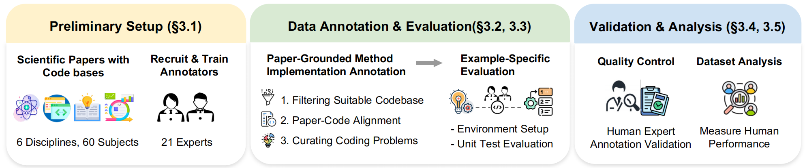

# MMSciCode

<p align="center">
    🤗 <a href="https://huggingface.co/datasets/MMSciCode/MMSciCode">Hugging Face</a>&nbsp&nbsp | &nbsp&nbsp📄 <a href="https://aclanthology.org/2026.acl-long.1566/">ACL 2026 Paper</a>
</p>

## 📖 Abstract

**MMSciCode** is a comprehensive expert-level, multilingual multi-discipline
benchmark for evaluating foundation models in scientific code generation. It
contains **624 expert-annotated function-level research coding problems**
extracted from **285 scientific papers and codebases**, spanning **38 subjects**
across **six scientific disciplines** and three programming languages: Python,
C/C++, and R.

Each task asks a model to recover a masked core function from paper evidence,
repository context, and sample-specific implementation metadata. The generated
function is inserted back into the original project and evaluated with unit
tests in containerized environments, enabling reproducible and diagnostic
evaluation of functional correctness and domain validity. The paper evaluates
23 foundation models and 2 coding agents, revealing substantial gaps between
current models and expert-level scientific research coding.

<div align="center">

<p><em>Overview of the MMSciCode benchmark construction pipeline.</em></p>
</div>

## 🗂️ Dataset

Download the benchmark data from
[Hugging Face](https://huggingface.co/datasets/MMSciCode/MMSciCode):

```bash
git lfs install
git clone https://huggingface.co/datasets/MMSciCode/MMSciCode dataset
```

The Hugging Face repository provides both the benchmark samples and the Docker
environment assets used for reproducible evaluation.

```text
dataset/
  Python/
    data/<sample_id>/
    dockerfiles/<environment_id>/
  R/
    data/<sample_id>/
    dockerfiles/<environment_id>/
  C_CPP/
    data/<sample_id>/
    dockerfiles/<environment_id>/
  manifest.jsonl
  index.tsv
  build_all_serial.sh
  distributable_env_dockerfiles.tar.gz
```

| Item | Count |
|---|---:|
| Function-level tasks | 624 |
| Source sample directories | 285 |
| Python samples | 203 |
| R samples | 60 |
| C/C++ samples | 22 |
| Dockerfile environment directories | 204 |

Each sample directory includes files such as `selected_core_functions.json`,
`article_content.json`, `unit_test_status.json`, and the original project code.
`manifest.jsonl` is a flat index with one row per benchmark task
(`language`, `sample_id`, `function_name`, `file_path`, `conda_env`,
`docker_image`, ...). The root `index.tsv` lists 204 Docker image entries and
maps each image name to an environment ID and Dockerfile directory.
`build_all_serial.sh` builds the indexed Docker environments, while
`distributable_env_dockerfiles.tar.gz` provides the same Dockerfile assets as a
standalone package.

Field-level schema, including which `unit_test_status.json` fields are optional,
is documented in the [dataset card](https://huggingface.co/datasets/MMSciCode/MMSciCode).

Set the downloaded data path before running local evaluation:

```bash
export MMSCI_DATA_ROOT=/path/to/dataset
```

## ⚙️ Evaluation

Evaluation has three stages — **infer** (call the model), **insert** (splice the
generated function back into the project), and **run** (execute that sample's
unit tests). The run stage executes each sample's tests in the exact
environment its authors used (its conda env / R / toolchain), which lives
**inside that sample's Docker image**. So the reproducible path runs all three
stages *inside the container*.

### Recommended: containerized evaluation

1. Build the environments once (from the downloaded dataset root — see the
   [dataset card](https://huggingface.co/datasets/MMSciCode/MMSciCode)):

   ```bash
   cd "$MMSCI_DATA_ROOT" && ./build_all_serial.sh      # builds the 204 indexed images
   ```

2. Configure model credentials:

   ```bash
   cp .env.example .env        # then edit .env and set OPENAI_API_KEY
   ```

3. Run one sample inside its image, or the whole benchmark across all built
   images. These scripts run infer → insert → runner inside the container where
   the conda env exists:

   ```bash
   # one sample (image name comes from index.tsv / map_images.py)
   ./run_in_image.sh mmsci-py-001-rm-bench:latest 001_RM-Bench_... direct

   # batch: every locally-built image, logged, failures don't stop the run
   MMSCI_DATA_ROOT=/path/to/dataset ./run_completed_images.sh direct
   ```

   `map_images.py --data-root "$MMSCI_DATA_ROOT" --available-only` prints which
   samples map to which locally-available images.

### Host-level stages (advanced)

The three entry points can be run directly, but note the **run** stage needs the
sample's environment to be present locally (a conda env named after the sample's
`unit_test_status.json → environment.conda_env_name`, discoverable via
`--conda-root`); without it, `runner.py` reports `env_missing`. This is why the
containerized flow above is the supported way to reproduce the paper's numbers.

```bash
python3 -m pip install -r requirements.txt
export OPENAI_API_KEY=...

python3 infer.py "$MMSCI_DATA_ROOT/Python/data/<sample_id>" --mode direct --model gpt-5.4
python3 insert.py --all --data-root "$MMSCI_DATA_ROOT"
python3 runner.py --all --data-root "$MMSCI_DATA_ROOT" --conda-root /opt/conda
```

For other OpenAI-compatible services, pass `--base-url` and `--model`
explicitly.

## 📝 Citation

If you find MMSciCode useful in your research, please cite our paper:

```bibtex
@inproceedings{xia-etal-2026-mmscicode,
    title = "{MMS}ci{C}ode: Real-world Evaluation of Multilingual Multi-Discipline Scientific Research Coding",
    author = "Xia, Xue and Yang, Zheyuan and Cohan, Arman and Zhao, Yilun",
    editor = "Liakata, Maria and Moreira, Viviane P. and Zhang, Jiajun and Jurgens, David",
    booktitle = "Proceedings of the 64th Annual Meeting of the Association for Computational Linguistics (Volume 1: Long Papers)",
    month = jul,
    year = "2026",
    address = "San Diego, California, United States",
    publisher = "Association for Computational Linguistics",
    url = "https://aclanthology.org/2026.acl-long.1566/",
    doi = "10.18653/v1/2026.acl-long.1566",
    pages = "33981--33999",
    ISBN = "979-8-89176-390-6"
}
```
